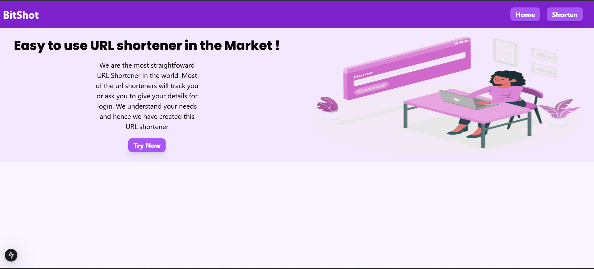

# 🔗 Bitshot - URL Shortener

Bitshot is a simple and modern **URL shortener** built with **Next.js** and **Tailwind CSS**.  
It allows users to convert long, messy URLs into short, shareable links instantly.

## ✨ Features

- 🔑 Shorten long URLs into clean links  
- 📋 Copy shortened links with one click  
- 🎨 Beautiful UI powered by Tailwind CSS  
- ⚡ Fast and optimized with Next.js  
- 🌐 Deployed on Vercel for seamless performance

-- Screenshots :

## 🛠️ Tech Stack

- **Frontend:** [Next.js](https://nextjs.org/), [React](https://react.dev/)  
- **Styling:** [Tailwind CSS](https://tailwindcss.com/)  
- **Deployment:** [Vercel](https://vercel.com/)  
- **Utilities:** Custom helper functions in `lib/`

## ⚙️ Installation & Setup

Clone the repo and run the project locally:

# Clone the repo
git clone https://github.com/purakh/Bitshot.git

# Navigate into the folder
cd Bitshot

# Install dependencies
npm install   # or yarn install

# Start development server
npm run dev   # or yarn dev
Now open http://localhost:3000 in your browser 
